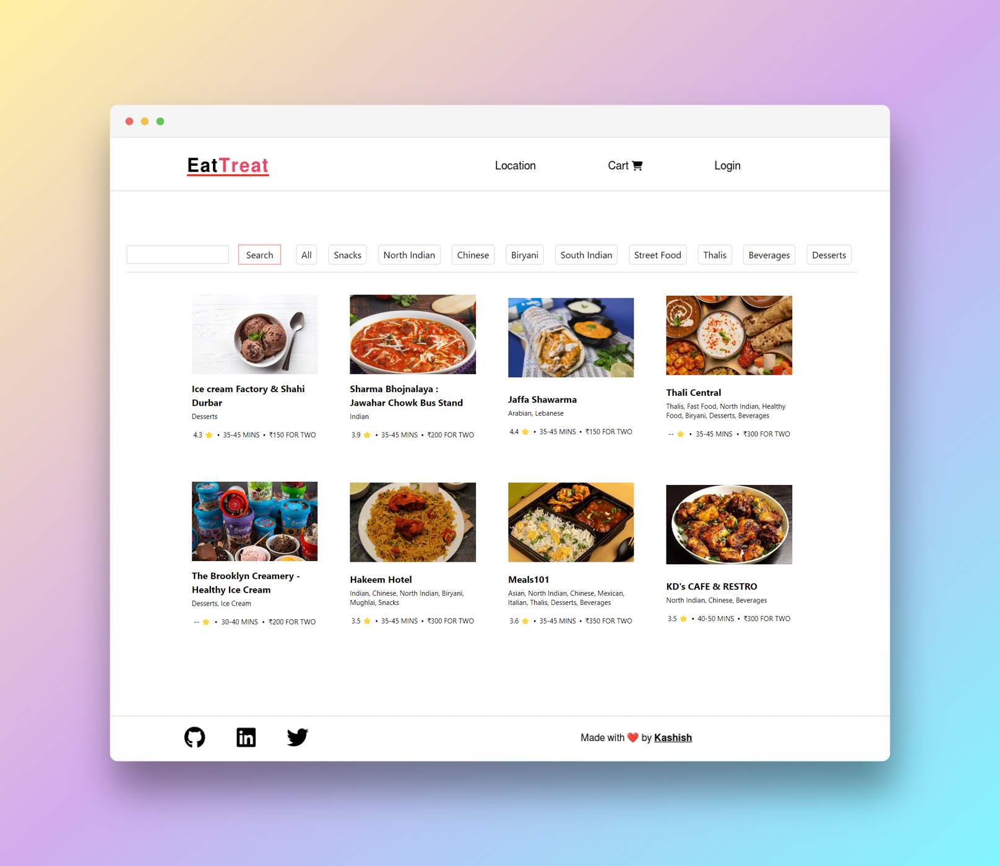
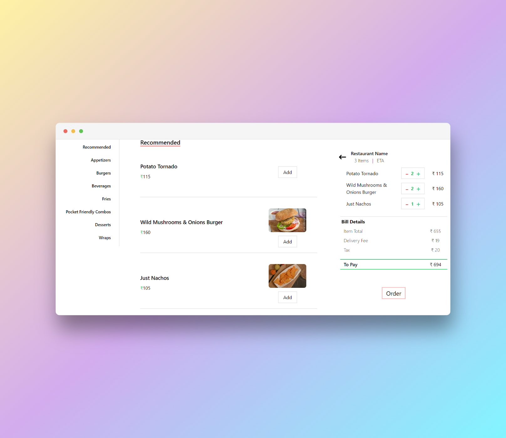
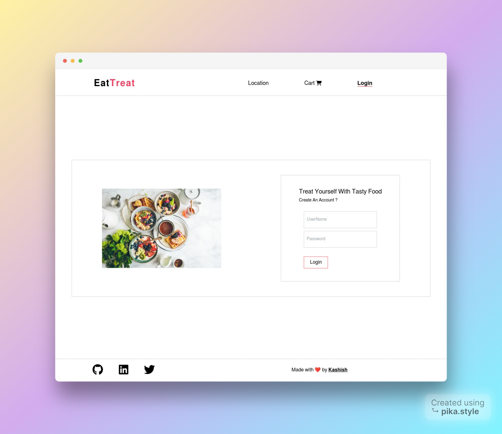

## Eat-Treat

This is a food ordering app that has been created using modern technologies such as React, Redux-toolkit and Firebase Authentication. Styled using TailwindCSS. The website is mobile Responsive.

Project Completed. [Live](https://eat-treat.netlify.app/)

## Functionalities

- Add items to cart.
- Location-based restaurants.
- User Login.
- Infinite Scrolling to load more restaurants.❌(Currently not working)

Cart and Menu

User Login

